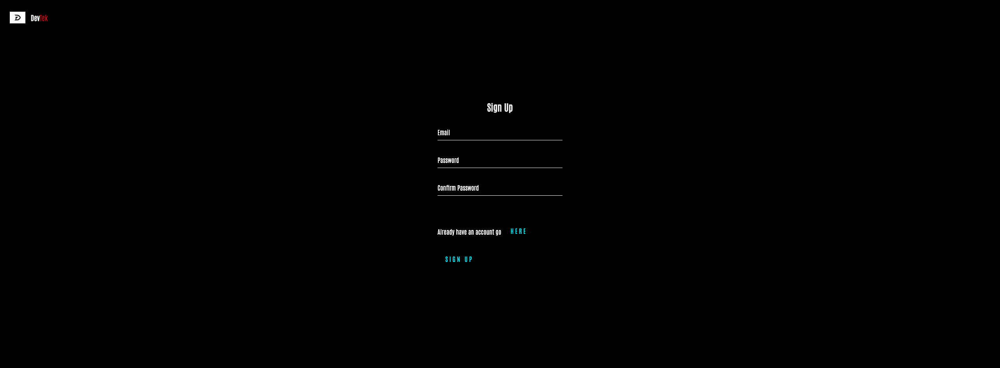

# Project2 DevTek (MVC Model) :space_invader:


## Description 
DevTek an ECOMM MVC application (utilizing handlebars.js) with social media/blog adaption for the ultimate developer community. Account creation and storage is also a huge factor to get this savvy app running properly. Sleek design and a modern approach to the ever-growing tech empire. :robot:

## Usage 
Instructions will be shown below for npm installation methods....However if youd like to use it with a GUI CLI app creator such as Heroku 
Visit the app [here](https://agile-sea-60043.herokuapp.com) :alien:

## User Story 
```md 
AS A USER I want to find products that cater towards my tech lifestyle and career 
I WANT to be able to share my opinions regarding trending tech products with other people
I ALSO WANT my opinions to be heard 
WHILE having a retail aspect within the application as well.
```

## Screenshots
As a new user You get to create a profile!!! :dizzy:



Then you get directed after you login to the hompage :nerd_face:


Here is our PC section within the application. SHowcasing the latest and greatest :computer:


If you click on the product it takes you to... :package:


Here is the blog section of the application :envelope_with_arrow:


Where you also have the ability to submit a blog!! :outbox_tray:


Just wanted to showcase some of the functionalities and aestheics! Use the application to dive deeper :test_tube:


## Installation 
This is a full stack application so it is running 

```md
npm start
```
In the projects directory but you can also visit the deployed heroku url [here](https://agile-sea-60043.herokuapp.com)


With that being said I will go one by one with the proper dependency installations that must take place :old_key:

Express 
```md
npm i express
```

Dotenv
```md
npm i dotenv
```

Sequelize
```md
npm i sequelize
```

Handlebars.js
```md
npm install handlebars
```
Masonry 
```md
npm install masonary-layout 
```

## Future Development 
This application is amazing and we feel accomplished to be able to get it to this level within 2 weeks. However there are some components that will be a work in progress. 

Stay tuned for updates as I’ll be adding onto this project for my portfolio 


## Contact
[James](mailto:jamesthomaspatmore7@gmail.com)
[Marcel](mailto:marcelbachelier232@gmail.com)
[Jed](mailto:schuylertjed@gmail.com)
[Zak](mailto:Taylorzak@hotmail.com)
</br>
…


